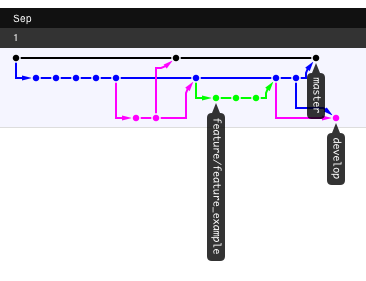
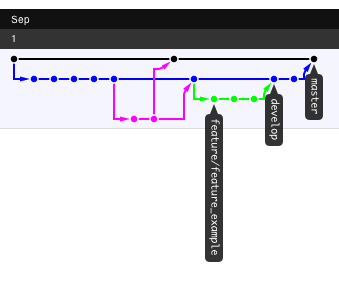

# Git Flow by example using GitHub

## Initial Setup

We start with this


```bash
➜  Git-Flow-Example git:(master) git flow init

No branches exist yet. Base branches must be created now.
Branch name for production releases: [master]
Branch name for "next release" development: [develop]

How to name your supporting branch prefixes?
Feature branches? [feature/]
Bugfix branches? [bugfix/]
Release branches? [release/]
Hotfix branches? [hotfix/]
Support branches? [support/]
Version tag prefix? []
```

Then after pushing the develop branch to github, we get this:


## Release branches

* **May branch off from:** develop
* **Must merge back into:** develop and master
* **Branch naming convention:** release-*

So far, we have been working on the development version.
Even though this post isn't production ready, I'm going to make a release branch using git flow.

```bash
➜  Git-Flow-Example git:(develop) git flow release start v0.1
Switched to a new branch 'release/v0.1'

Summary of actions:
- A new branch 'release/v0.1' was created, based on 'develop'
- You are now on branch 'release/v0.1'

Follow-up actions:
- Bump the version number now!
- Start committing last-minute fixes in preparing your release
- When done, run:

     git flow release finish 'v0.1'
```

When creating a release branch, it uses the current state of 'develop' branch as its base. You can make any further small commits to make it production ready, then you can run `git flow release finish 'v0.1'` to finish the release.

When the release is finished, the release branch will be merged to master.

## Feature branches

* **May branch off from:** develop
* **Must merge back into:** develop
* **Branch naming convention:** feature/feature_name

Feature branches are where you'll do most of your work. This chapter is a feature branch. You make your changes, and commit to the branch, and when the branch is ready, it will be merged back into develop.

```bash
➜  Git-Flow-Example git:(develop) git flow feature start feature_example
Switched to a new branch 'feature/feature_example'

Summary of actions:
- A new branch 'feature/feature_example' was created, based on 'develop'
- You are now on branch 'feature/feature_example'

Now, start committing on your feature. When done, use:

     git flow feature finish feature_example

```

There are quite a few options for git flow feature. You can find them buy running `git flow feature help`:

```bash
git flow feature help
usage: git flow feature [list] [-v]
       git flow feature start [-F] <name> [<base>]
       git flow feature finish [-rF] <name|nameprefix>
       git flow feature publish <name>
       git flow feature track <name>
       git flow feature diff [<name|nameprefix>]
       git flow feature rebase [-i] [<name|nameprefix>]
       git flow feature checkout [<name|nameprefix>]
       git flow feature pull <remote> [<name>]
```

If we push a feature branch to GitHub without releasing it(`git push origin feature/feature_example`), the network graph looks like this:


Once we release the feature by running `git flow feature finish feature_example`, the changes on the feature branch are merged back into the **develop** branch, but not the master branch.

```bash
➜  Git-Flow-Example git:(feature/feature_example)  git flow feature finish feature_example
Switched to branch 'develop'
Update 37fcbd1..be88604
Fast-forward
    README.md                     |   56 +++++++++++++++++++++++++++++++++++++++++
    images/network-newfeature.png |  Bin 0 -> 14738 bytes
    2 files changed, 56 insertions(+), 0 deletions(-)
    create mode 100644 images/network-newfeature.png
Deleted branch feature/feature_example (was be88604).

Summary of actions:
- The feature branch 'feature/feature_example' was merged into 'develop'
- Feature branch 'feature/feature_example' has been locally deleted
- You are now on branch 'develop'
```

Once the develop branch is pushed to GitHub, network graph looks like this:


Now it's time for another release

```bash
➜  Git-Flow-Example git:(release/v0.2) git flow release finish v0.2
Switched to branch 'master'
Merge made by recursive.
     README.markdown                        |   66 ++++++++++++++++++++++++++++++++
     images/network-after-feature-merge.png |  Bin 0 -> 15281 bytes
     images/network-newfeature.png          |  Bin 0 -> 14738 bytes
     3 files changed, 66 insertions(+), 0 deletions(-)
     create mode 100644 images/network-after-feature-merge.png
     create mode 100644 images/network-newfeature.png
Switched to branch 'develop'
Merge made by recursive.
     README.markdown                        |   18 ++++++++++++++----
     images/network-after-feature-merge.png |  Bin 0 -> 15281 bytes
     2 files changed, 14 insertions(+), 4 deletions(-)
     create mode 100644 images/network-after-feature-merge.png
Deleted branch release/v0.2 (was 62426bf).

Summary of actions:
- Latest objects have been fetched from 'origin'
- Release branch has been merged into 'master'
- The release was tagged 'v0.2'
- Release branch has been back-merged into 'develop'
- Release branch 'release/v0.2' has been deleted
```

Note in the above description of what happened - Release branch has been merged into 'master' and Release branch has been back-merged into 'develop'

If we want others to have access to the release on GitHub, we need to push both master and develop branches.

After pushing the develop branch with `git push origin develop` :



After pushing the master branch with `git push origin master` :



## Further Resources

* [A successful Git branching model](http://nvie.com/git-model)
* [Git Flow](http://github.com/nvie/gitflow)
* [Git Flow Cheatsheet](http://danielkummer.github.io/git-flow-cheatsheet/) | Thanks [Denis Novikov](https://github.com/denisnovikov)

This tutorial was created by [Eaden McKee](http://www.eadz.co.nz/) and licensed [Creative Commons by-nc-sa](http://creativecommons.org/licenses/by-nc-sa/3.0/nz/)